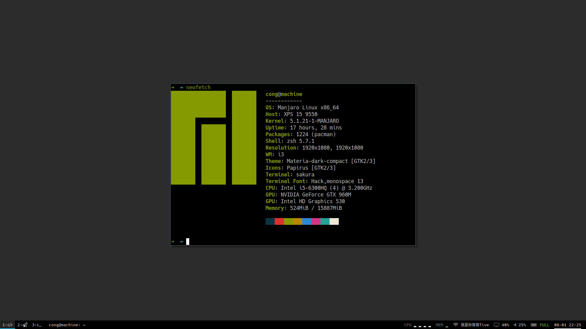

### i3config

My manjaro-i3 config

### Changes

- use autorandr and srandrd to switch display mode automatically when external monitor attach/detach
- use Noto Sans CJK SC font, sakura terminal and fcitx5 to support Chinese display and input
- use rofi to replace dmenu
- use polybar to replace i3bar (need restart i3 to make polybar run)
